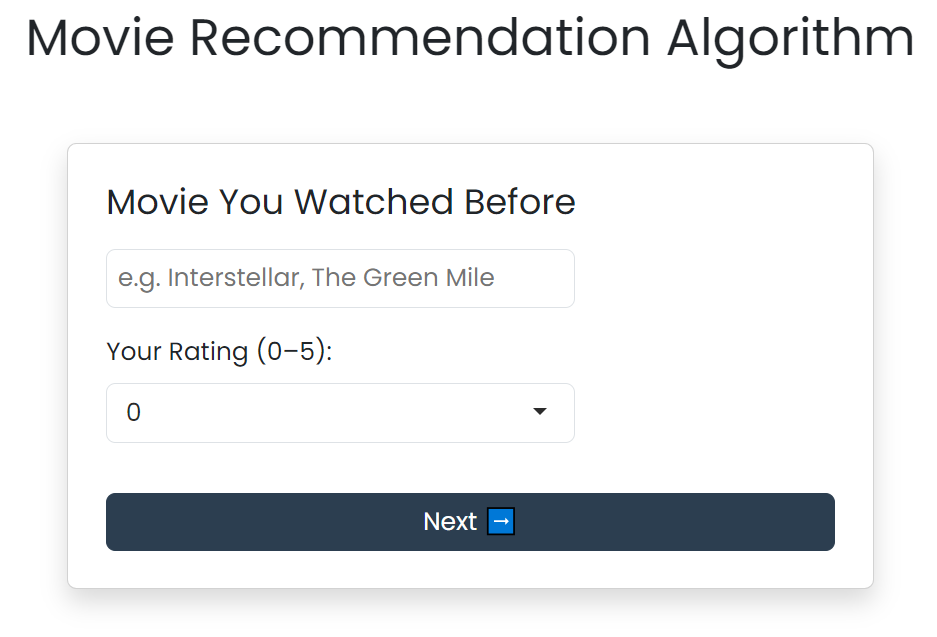
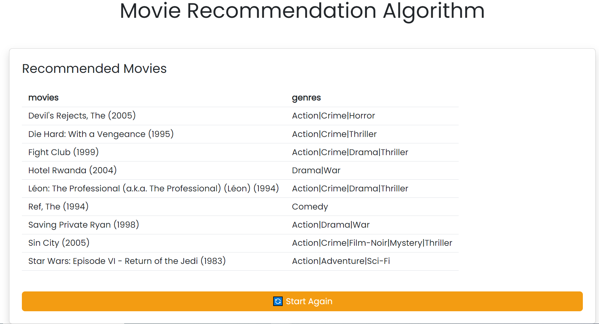

# Movie Recommendation Algorithm
By utilizing collaborative filtering, you can have recommendations based on your preferences. Simply put three movies and evaluate, then receive movie recommendations.

A huge dataset serviced by [Movilens](https://grouplens.org/datasets/movielens/) is employed. The dataset includes huge numbers of users and their scoring related to movies. This helps to provide best movie recommendations, as the algorithm finds the most similar user in the dataset, and displays movies that this similar user liked.

